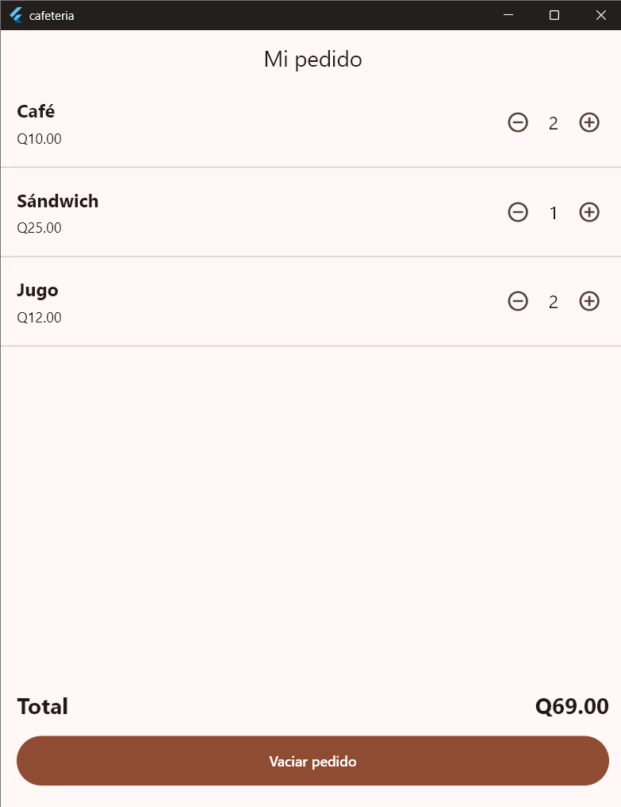

# Laboratorio: Mi pedido de cafetería

Aplicación Flutter con tres productos (Café, Sándwich y Jugo), controles de
cantidad, total en quetzales y botón para vaciar el pedido.

## Captura (pedido de Q57.00)

## ¿Cómo calcula el total y por qué conviene reutilizar ProductoPedido?

**Cálculo del total:** el total es un getter que suma precio × cantidad de cada
producto (`cafe * 10 + sandwich * 25 + jugo * 12`). Como las cantidades se
modifican dentro de `setState`, Flutter reconstruye la pantalla y el total se
recalcula y se muestra con dos decimales (`toStringAsFixed(2)`) en cada cambio.

**Reutilizar ProductoPedido:** las tres filas tienen la misma estructura
(nombre, precio y controles -/+). Con un solo widget que recibe los datos y las
acciones por parámetros evito repetir código, el diseño es consistente en todas
las filas, es más fácil corregir o mejorar un cambio en un solo lugar y agregar
un producto nuevo solo requiere una llamada más.